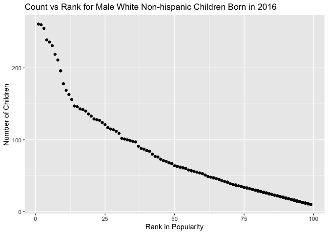

p8105\_hw2\_ly2565
================
Lin Yang
10/02/2021

``` r
library(tidyverse)
```

    ## ── Attaching packages ─────────────────────────────────────── tidyverse 1.3.1 ──

    ## ✓ ggplot2 3.3.5     ✓ purrr   0.3.4
    ## ✓ tibble  3.1.3     ✓ dplyr   1.0.7
    ## ✓ tidyr   1.1.3     ✓ stringr 1.4.0
    ## ✓ readr   2.0.1     ✓ forcats 0.5.1

    ## ── Conflicts ────────────────────────────────────────── tidyverse_conflicts() ──
    ## x dplyr::filter() masks stats::filter()
    ## x dplyr::lag()    masks stats::lag()

``` r
library(readxl)
```

# Problem 1

## Read and clean the Mr. Trash Wheel dataset.

``` r
trash_wheel_df = read_excel("data/Trash-Wheel-Collection-Totals-8-6-19.xlsx", sheet = "Mr. Trash Wheel", range = "A2:N408") %>%  
  janitor::clean_names() %>% 
  drop_na(dumpster) %>% 
  mutate(sports_balls = round(sports_balls, digits = 0))
trash_wheel_df
```

    ## # A tibble: 344 × 14
    ##    dumpster month  year date                weight_tons volume_cubic_yards
    ##       <dbl> <chr> <dbl> <dttm>                    <dbl>              <dbl>
    ##  1        1 May    2014 2014-05-16 00:00:00        4.31                 18
    ##  2        2 May    2014 2014-05-16 00:00:00        2.74                 13
    ##  3        3 May    2014 2014-05-16 00:00:00        3.45                 15
    ##  4        4 May    2014 2014-05-17 00:00:00        3.1                  15
    ##  5        5 May    2014 2014-05-17 00:00:00        4.06                 18
    ##  6        6 May    2014 2014-05-20 00:00:00        2.71                 13
    ##  7        7 May    2014 2014-05-21 00:00:00        1.91                  8
    ##  8        8 May    2014 2014-05-28 00:00:00        3.7                  16
    ##  9        9 June   2014 2014-06-05 00:00:00        2.52                 14
    ## 10       10 June   2014 2014-06-11 00:00:00        3.76                 18
    ## # … with 334 more rows, and 8 more variables: plastic_bottles <dbl>,
    ## #   polystyrene <dbl>, cigarette_butts <dbl>, glass_bottles <dbl>,
    ## #   grocery_bags <dbl>, chip_bags <dbl>, sports_balls <dbl>,
    ## #   homes_powered <dbl>

## Read and clean precipitation data for 2018 and 2019.

``` r
prcp_2018_df = 
  read_excel("data/Trash-Wheel-Collection-Totals-8-6-19.xlsx", sheet = "2018 Precipitation", range = "A2:B14") %>% 
  janitor::clean_names() %>% 
  mutate(year = 2018) %>% 
  relocate(year)

prcp_2019_df = 
  read_excel("data/Trash-Wheel-Collection-Totals-8-6-19.xlsx", sheet = "2019 Precipitation", range = "A2:B8") %>% 
  janitor::clean_names() %>% 
  mutate(year = 2019) %>% 
  relocate(year)
```

## Combine precipaitation datasets.

``` r
comb_prcp_df = 
  bind_rows(prcp_2018_df, prcp_2019_df) %>% 
  mutate(month = month.name[month])
comb_prcp_df
```

    ## # A tibble: 18 × 3
    ##     year month     total
    ##    <dbl> <chr>     <dbl>
    ##  1  2018 January    0.94
    ##  2  2018 February   4.8 
    ##  3  2018 March      2.69
    ##  4  2018 April      4.69
    ##  5  2018 May        9.27
    ##  6  2018 June       4.77
    ##  7  2018 July      10.2 
    ##  8  2018 August     6.45
    ##  9  2018 September 10.5 
    ## 10  2018 October    2.12
    ## 11  2018 November   7.82
    ## 12  2018 December   6.11
    ## 13  2019 January    3.1 
    ## 14  2019 February   3.64
    ## 15  2019 March      4.47
    ## 16  2019 April      1.46
    ## 17  2019 May        3.58
    ## 18  2019 June       0.42

-   The 2018 precipitation dataset has 12 rows and 3 columns with
    variable names: year, month, total. It has precipitation data for
    all 12 months of 2018. The total precipitation in 2018 is 70.33
    inches.
-   The 2019 precipitation dataset has 6 row and 3 columns with variable
    names: year, month, total. It has precipitation data for only 6
    months of 2019 (Jan-Jun). The total precipitation in 2019 is 16.67
    inches.
-   The combined precipitation dataset has 18 rows and 3 columns with
    varibale names: year, month, total. In the two years, 2018 and 2019,
    2018 Sep had the most precipitation which was 10.47 inches.
-   The median number of sports balls in a dumpster in 2019 is 8.5.

# Problem 2

## Clean pols\_month dataset.

``` r
pols_month_df = 
  read_csv(file = "data/pols-month.csv") %>% 
  janitor::clean_names() %>% 
  separate(mon, into = c("year", "month", "day")) %>% 
  mutate(
    month = month.name[as.numeric(month)],
    president = ifelse(prez_dem == 1, "dem", "gop")) %>%
  select(-prez_gop, -prez_dem, -day)
```

    ## Rows: 822 Columns: 9

    ## ── Column specification ────────────────────────────────────────────────────────
    ## Delimiter: ","
    ## dbl  (8): prez_gop, gov_gop, sen_gop, rep_gop, prez_dem, gov_dem, sen_dem, r...
    ## date (1): mon

    ## 
    ## ℹ Use `spec()` to retrieve the full column specification for this data.
    ## ℹ Specify the column types or set `show_col_types = FALSE` to quiet this message.

``` r
pols_month_df  
```

    ## # A tibble: 822 × 9
    ##    year  month     gov_gop sen_gop rep_gop gov_dem sen_dem rep_dem president
    ##    <chr> <chr>       <dbl>   <dbl>   <dbl>   <dbl>   <dbl>   <dbl> <chr>    
    ##  1 1947  January        23      51     253      23      45     198 dem      
    ##  2 1947  February       23      51     253      23      45     198 dem      
    ##  3 1947  March          23      51     253      23      45     198 dem      
    ##  4 1947  April          23      51     253      23      45     198 dem      
    ##  5 1947  May            23      51     253      23      45     198 dem      
    ##  6 1947  June           23      51     253      23      45     198 dem      
    ##  7 1947  July           23      51     253      23      45     198 dem      
    ##  8 1947  August         23      51     253      23      45     198 dem      
    ##  9 1947  September      23      51     253      23      45     198 dem      
    ## 10 1947  October        23      51     253      23      45     198 dem      
    ## # … with 812 more rows

## Clean snp dataset.

``` r
snp_df = 
  read_csv(file = "data/snp.csv") %>% 
  janitor::clean_names() %>% 
  separate(date, into = c("month", "day", "year"), convert = TRUE) %>% 
  mutate(
    year = ifelse(year <= 15, year + 2000, year + 1900),
    month = factor(month.name[month], levels = month.name)) %>% 
  select(-day) %>% 
  relocate(year, month) %>% 
  mutate(
    year = as.character(year),
    month = as.character(month)
  )
```

    ## Rows: 787 Columns: 2

    ## ── Column specification ────────────────────────────────────────────────────────
    ## Delimiter: ","
    ## chr (1): date
    ## dbl (1): close

    ## 
    ## ℹ Use `spec()` to retrieve the full column specification for this data.
    ## ℹ Specify the column types or set `show_col_types = FALSE` to quiet this message.

``` r
snp_df
```

    ## # A tibble: 787 × 3
    ##    year  month    close
    ##    <chr> <chr>    <dbl>
    ##  1 2015  July     2080.
    ##  2 2015  June     2063.
    ##  3 2015  May      2107.
    ##  4 2015  April    2086.
    ##  5 2015  March    2068.
    ##  6 2015  February 2104.
    ##  7 2015  January  1995.
    ##  8 2014  December 2059.
    ##  9 2014  November 2068.
    ## 10 2014  October  2018.
    ## # … with 777 more rows

## Clean unemployment dataset.

``` r
unemploy_df =
  read_csv(file = "data/unemployment.csv") %>%
  rename_with(~ month.name, month.abb) %>% 
  pivot_longer(
    January:December,
    names_to = "month",
    values_to = "unemploy_percent") %>% 
  janitor::clean_names() %>% 
  mutate(year = as.character(year))
```

    ## Rows: 68 Columns: 13

    ## ── Column specification ────────────────────────────────────────────────────────
    ## Delimiter: ","
    ## dbl (13): Year, Jan, Feb, Mar, Apr, May, Jun, Jul, Aug, Sep, Oct, Nov, Dec

    ## 
    ## ℹ Use `spec()` to retrieve the full column specification for this data.
    ## ℹ Specify the column types or set `show_col_types = FALSE` to quiet this message.

    ## Note: Using an external vector in selections is ambiguous.
    ## ℹ Use `all_of(month.abb)` instead of `month.abb` to silence this message.
    ## ℹ See <https://tidyselect.r-lib.org/reference/faq-external-vector.html>.
    ## This message is displayed once per session.

``` r
unemploy_df
```

    ## # A tibble: 816 × 3
    ##    year  month     unemploy_percent
    ##    <chr> <chr>                <dbl>
    ##  1 1948  January                3.4
    ##  2 1948  February               3.8
    ##  3 1948  March                  4  
    ##  4 1948  April                  3.9
    ##  5 1948  May                    3.5
    ##  6 1948  June                   3.6
    ##  7 1948  July                   3.6
    ##  8 1948  August                 3.9
    ##  9 1948  September              3.8
    ## 10 1948  October                3.7
    ## # … with 806 more rows

## Merge snp into pols, and then merge unemployment.

``` r
merging_df =
  left_join(pols_month_df, snp_df, by = c("year", "month")) %>% 
  left_join(unemploy_df, by = c("year", "month"))
merging_df
```

    ## # A tibble: 822 × 11
    ##    year  month   gov_gop sen_gop rep_gop gov_dem sen_dem rep_dem president close
    ##    <chr> <chr>     <dbl>   <dbl>   <dbl>   <dbl>   <dbl>   <dbl> <chr>     <dbl>
    ##  1 1947  January      23      51     253      23      45     198 dem          NA
    ##  2 1947  Februa…      23      51     253      23      45     198 dem          NA
    ##  3 1947  March        23      51     253      23      45     198 dem          NA
    ##  4 1947  April        23      51     253      23      45     198 dem          NA
    ##  5 1947  May          23      51     253      23      45     198 dem          NA
    ##  6 1947  June         23      51     253      23      45     198 dem          NA
    ##  7 1947  July         23      51     253      23      45     198 dem          NA
    ##  8 1947  August       23      51     253      23      45     198 dem          NA
    ##  9 1947  Septem…      23      51     253      23      45     198 dem          NA
    ## 10 1947  October      23      51     253      23      45     198 dem          NA
    ## # … with 812 more rows, and 1 more variable: unemploy_percent <dbl>

-   The `pols_month` dataset has 822 rows and 9 columns with variable
    names: year, month, gov\_gop, sen\_gop, rep\_gop, gov\_dem,
    sen\_dem, rep\_dem, president. The year range is from 1947 to 2015.
-   The `snp` dataset has 787 rows and 3 columns with variable names:
    year, month, close. It contains the closing values of the Standard &
    Poor’s stock index on the associated date 1950 to 2015.
-   The `unemployment` dataset has 816 rows and 3 columns with variable
    names: year, month, unemploy\_percent. The year range is from 1948
    to 2015.
-   The resulting dataset has 822 rows and 11 columns with variable
    names: year, month, gov\_gop, sen\_gop, rep\_gop, gov\_dem,
    sen\_dem, rep\_dem, president, close, unemploy\_percent.

# Problem 3

## Load and tidy the popular baby name dataset.

``` r
babyname_df = 
  read_csv(file = "data/Popular_Baby_Names.csv") %>% 
  janitor::clean_names() %>% 
  mutate(
    gender = str_to_lower(gender),
    ethnicity = str_to_title(ethnicity),
    childs_first_name = str_to_title(childs_first_name),
    ethnicity = recode(ethnicity,
                       "Black Non Hisp" = "Black Non Hispanic",
                       "Asian And Paci" = "Asian And Pacific Islander",
                       "White Non Hisp" = "White Non Hispanic")
  ) %>% 
  distinct()
```

    ## Rows: 19418 Columns: 6

    ## ── Column specification ────────────────────────────────────────────────────────
    ## Delimiter: ","
    ## chr (3): Gender, Ethnicity, Child's First Name
    ## dbl (3): Year of Birth, Count, Rank

    ## 
    ## ℹ Use `spec()` to retrieve the full column specification for this data.
    ## ℹ Specify the column types or set `show_col_types = FALSE` to quiet this message.

``` r
babyname_df
```

    ## # A tibble: 12,181 × 6
    ##    year_of_birth gender ethnicity                  childs_first_name count  rank
    ##            <dbl> <chr>  <chr>                      <chr>             <dbl> <dbl>
    ##  1          2016 female Asian And Pacific Islander Olivia              172     1
    ##  2          2016 female Asian And Pacific Islander Chloe               112     2
    ##  3          2016 female Asian And Pacific Islander Sophia              104     3
    ##  4          2016 female Asian And Pacific Islander Emily                99     4
    ##  5          2016 female Asian And Pacific Islander Emma                 99     4
    ##  6          2016 female Asian And Pacific Islander Mia                  79     5
    ##  7          2016 female Asian And Pacific Islander Charlotte            59     6
    ##  8          2016 female Asian And Pacific Islander Sarah                57     7
    ##  9          2016 female Asian And Pacific Islander Isabella             56     8
    ## 10          2016 female Asian And Pacific Islander Hannah               56     8
    ## # … with 12,171 more rows

## Create a well-structured, reader-friendly table showing the rank in popularity of the name “Olivia”.

``` r
babyname_df %>% 
  filter(childs_first_name == "Olivia") %>% 
  select(year_of_birth, ethnicity, rank) %>% 
  pivot_wider(
    names_from = "year_of_birth",
    values_from = "rank") %>% 
  knitr::kable()
```

| ethnicity                  | 2016 | 2015 | 2014 | 2013 | 2012 | 2011 |
|:---------------------------|-----:|-----:|-----:|-----:|-----:|-----:|
| Asian And Pacific Islander |    1 |    1 |    1 |    3 |    3 |    4 |
| Black Non Hispanic         |    8 |    4 |    8 |    6 |    8 |   10 |
| Hispanic                   |   13 |   16 |   16 |   22 |   22 |   18 |
| White Non Hispanic         |    1 |    1 |    1 |    1 |    4 |    2 |

## Create a similar table showing the most popular name among male children.

``` r
babyname_df %>% 
  filter(rank == 1, gender == "male") %>% 
  select(year_of_birth, ethnicity, childs_first_name) %>% 
  pivot_wider(
    names_from = "year_of_birth",
    values_from = "childs_first_name") %>% 
  knitr::kable()
```

| ethnicity                  | 2016   | 2015   | 2014   | 2013   | 2012   | 2011    |
|:---------------------------|:-------|:-------|:-------|:-------|:-------|:--------|
| Asian And Pacific Islander | Ethan  | Jayden | Jayden | Jayden | Ryan   | Ethan   |
| Black Non Hispanic         | Noah   | Noah   | Ethan  | Ethan  | Jayden | Jayden  |
| Hispanic                   | Liam   | Liam   | Liam   | Jayden | Jayden | Jayden  |
| White Non Hispanic         | Joseph | David  | Joseph | David  | Joseph | Michael |

## scatter plot

``` r
babyname_df %>%
  filter(year_of_birth == 2016, gender == "male", ethnicity == "White Non Hispanic") %>% 
  ggplot(aes(x = rank, y = count)) +
  geom_point() 
```

<!-- -->
